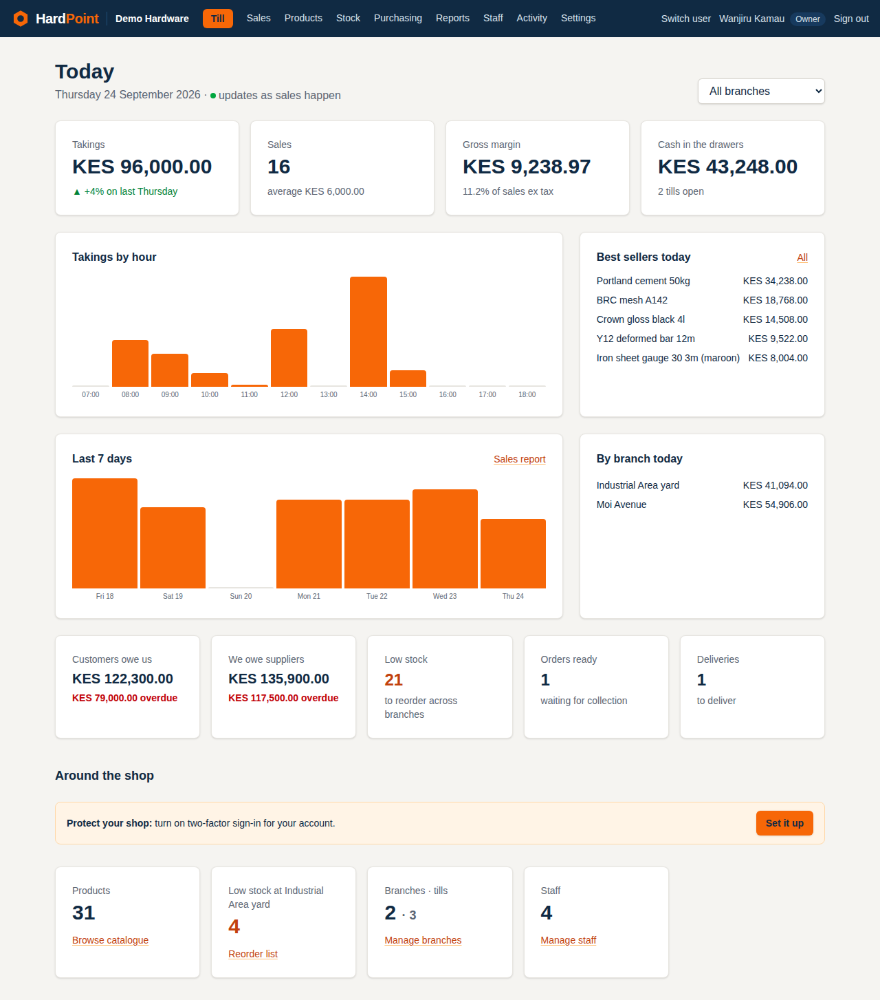
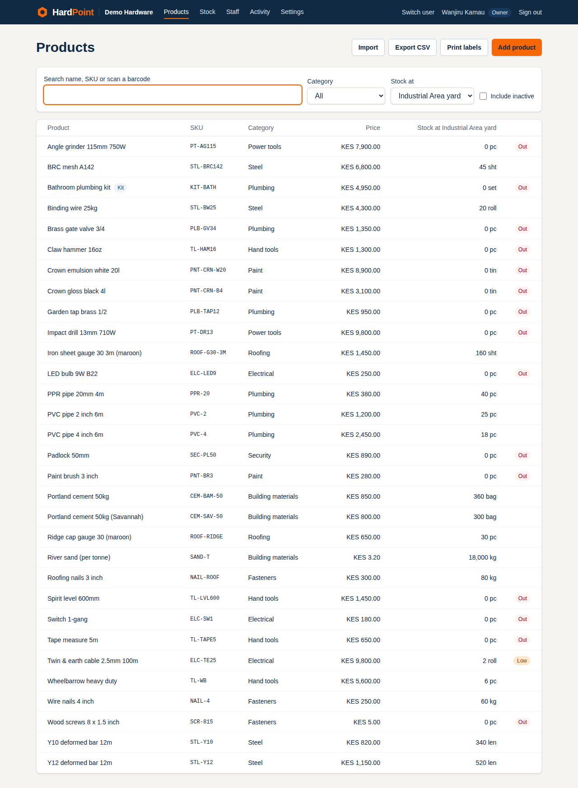
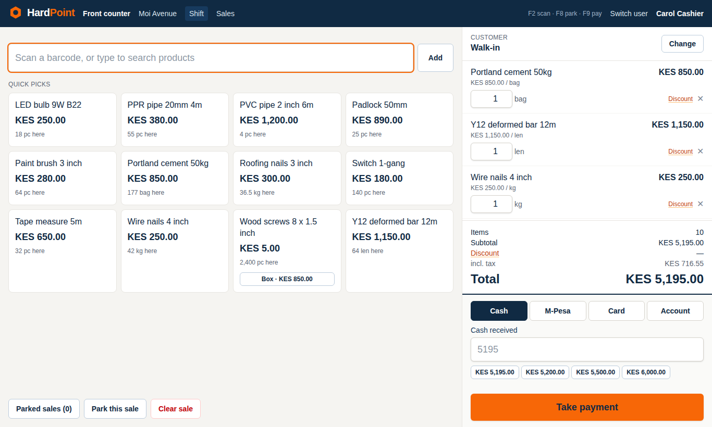
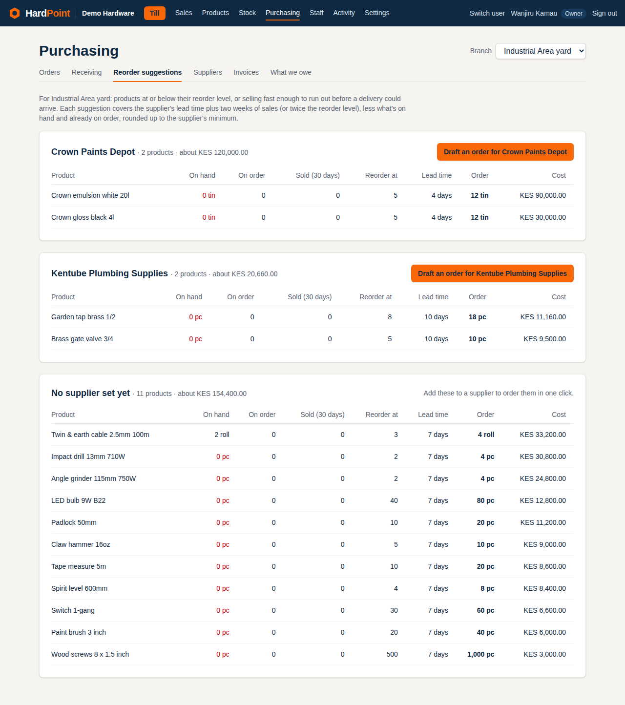
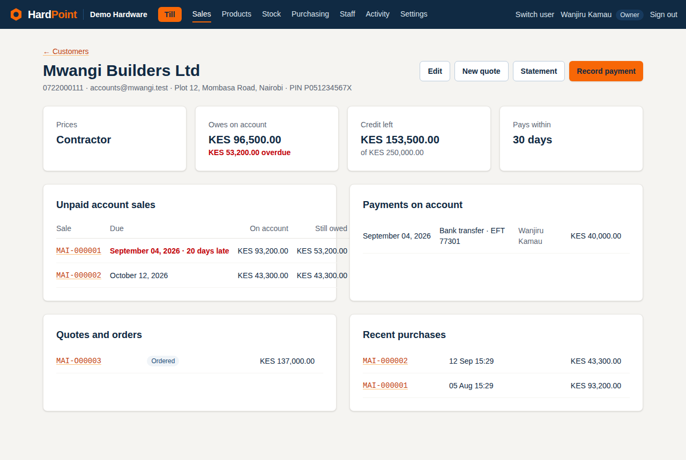
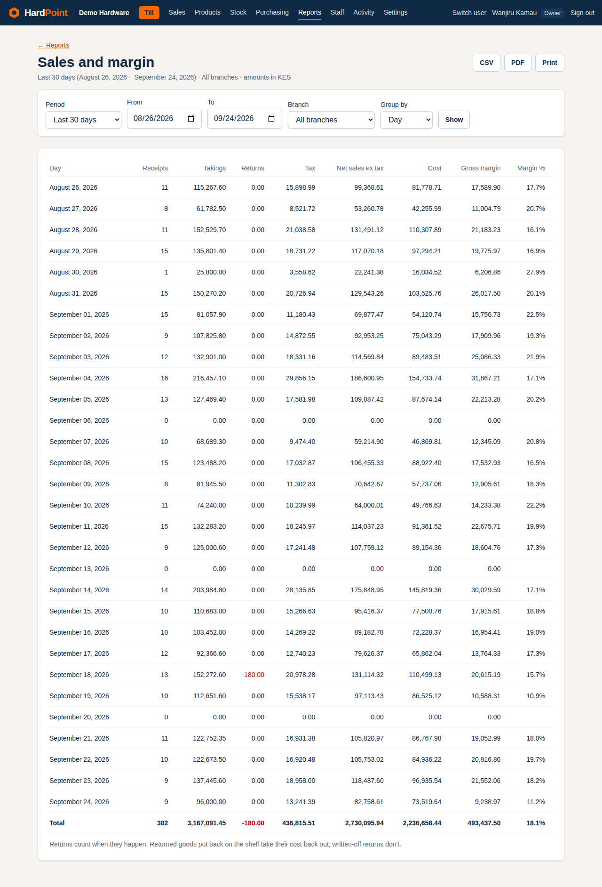
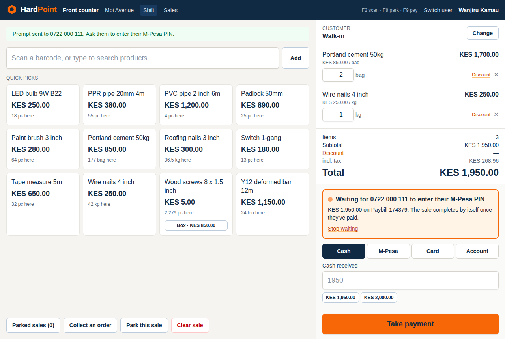
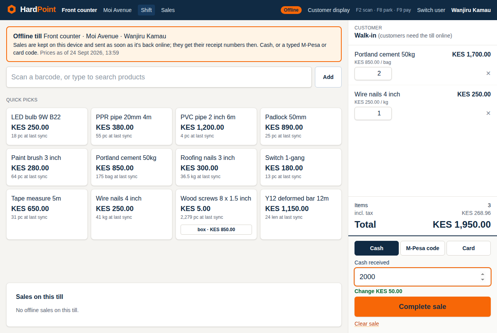
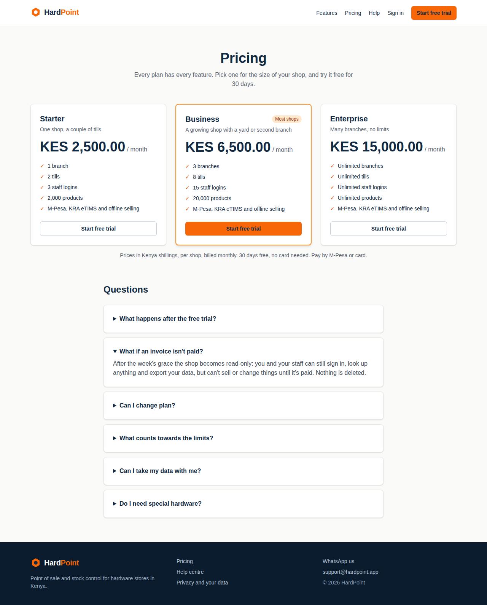

# HardPoint

Multi-tenant point of sale and stock control for hardware stores. Every shop gets its own
subdomain (`acme.hardpoint.app`), and no shop can see another shop's data.

Built the vanilla Rails way: Rails 8.1, PostgreSQL 18, Hotwire, Tailwind CSS 4, Solid Queue/Cache/Cable,
Minitest with fixtures, deployed with Kamal. See [docs/PLAN.md](docs/PLAN.md) for the full plan and
[docs/BRAND.md](docs/BRAND.md) for the brand colours.



## What's in it so far (Phase 1)

- **Shops on subdomains:** signup on the bare domain; each shop at `<name>.hardpoint.app`
- **Branches and tills** (registers) per shop
- **Staff and roles:** owner, manager, cashier, stock clerk, accountant; email invitations
- **Two-factor sign-in** (authenticator app + one-time recovery codes); shops can require it for owners and managers
- **Till PIN quick-switch:** cashiers and stock clerks switch in at a signed-in till with a 4–6 digit PIN (locks after 5 wrong tries)
- **Activity log:** an append-only audit trail of who changed what
- **Platform admin** on `admin.hardpoint.app`: separate sign-in with mandatory two-factor, a list of all shops, and
  support impersonation that is time-boxed to an hour, shown in a banner and recorded in the shop's Activity

## Phase 2: catalogue and stock

- **Catalogue:** categories (nested), brands, units (whole or fractional, e.g. kg and metres), tax rates, and
  products with a cost, a price and a photo
- **Barcodes:** several per product, for pack sizes too; products without one get an in-store EAN-13
- **Pack sizes** (a box of 200 screws with its own price), **kits** (made of other products), **price lists**
  (contractor, wholesale) and **quantity breaks**. Customers always get the lowest price that applies.
- **Fast search** by any words in the name or SKU, or by scanning a barcode (Postgres trigram indexes)
- **Stock ledger:** every change is an append-only movement; cached levels per branch are updated in the same
  transaction under a row lock, and the Stock page checks that levels still equal the sum of their movements
- **Adjustments** with reasons (opening, damaged, stolen, expired, found…), **branch transfers**
  (send → in transit → receive or cancel) and **stock takes** (full or by category, with scanner entry,
  variance at cost and manager approval)
- **Reorder list** per branch and a **daily low-stock email** to owners, managers and stock clerks
- **CSV import** with a full check and preview before anything changes (20,000 rows in about 12 seconds), and
  **CSV export** in the same format, so a shop can round-trip through Excel
- **Barcode labels** for A4 label sheets or 50 × 25 mm label printers, printed from the browser



## Phase 3: the till

- **Full-screen till**, scanner first: a barcode scanner types and presses Enter to add; typing searches; quick-pick
  buttons for fast movers and pack sizes. F2 scan · F8 park · F9 pay. Each device remembers its till.
- **Cart:** decimal quantities for fractional units, switching between pieces and packs, serial numbers for
  serialised items, stock warnings, and the customer's price list applied when you pick them
- **Discounts** per line or on the whole sale (amount or %). Above the shop's limit (5% by default) an owner or
  manager approves with an **approval PIN**, which authorises that one action and signs nobody in
- **Split payment** by cash (with change), M-Pesa (transaction code), card, or on account (within the customer's
  credit limit). Completing a sale assigns a **gap-free receipt number per branch** and takes the stock out
  (kits take their parts) in one transaction
- **Park and recall** sales, clear unwanted carts
- **Shifts:** opening float, cash drops, payouts and pay-ins, **X report** during the shift, **blind count** at close
  and a **Z report** with over/short
- **Voids** during the shift and **returns** against a receipt (restock or write off; refund by cash, M-Pesa,
  card or account credit), both needing approval and both recorded in Activity
- **80 mm thermal receipts** printed from the browser, reprints, and emailed receipts. Set the receipt printer's
  "open cash drawer" option to pop the drawer when a receipt prints
- **Sales history** by day, branch or receipt number, and simple **customer** records (prices, credit limit, balance)

A 10-line scanned sale with a split payment takes about 2.6 seconds end to end in a real browser (the plan's target
was under 30).



## Phase 4: purchasing

- **Suppliers** with contacts, payment terms, and the products they supply (their code, price, lead time, minimum
  order, preferred supplier)
- **Purchase orders**: draft → sent (emailed to the supplier with a PDF attached, or marked sent for phoned-in orders)
  → partially/fully received, numbered per branch (e.g. MOI-PO00012)
- **Receiving goods (GRNs)** against an order or without one: stock goes into the branch, transport and duty are
  spread over the lines by value, and each product's cost becomes the **weighted average** of old and new stock
- **Reorder suggestions** per branch from reorder levels, last 30 days' sales, supplier lead time, stock on order and
  minimum order sizes, grouped by supplier with a **one-click draft order**
- **Supplier invoices and payments** (payments settle the oldest invoices first), each supplier's balance, and a
  **What we owe** ageing report (not yet due, 1–30, 31–60, 61–90, over 90 days)
- Accountants get the money side (invoices, payments, ageing) without ordering; stock clerks order and receive



## Phase 5: customers, credit, quotes and invoices

- **Quotes → orders → collection**, one document all the way: a quote (PDF or email, valid for 14 days by default)
  is confirmed into an order, takes **deposits** (cash, M-Pesa, card or bank; refundable), is marked ready when the
  goods are in, and is **collected at the till** at the quoted prices, with the deposit as a tender
- **Invoices on account:** a sale put on account is the invoice, due after the customer's payment terms, with an
  **A4 tax invoice** PDF for trade customers
- **Payments on account** settle the oldest sales first; **statements** (PDF or email) bring the balance forward and
  run it through the period with ageing; **Who owes us** lists every customer's balance by how late it is
- **Credit limit at the till:** going over it needs an owner's or manager's approval PIN, recorded on the sale
- **Delivery notes** from a completed sale: printable note with a signature line, dispatch with driver and vehicle,
  and proof of delivery (who received it and a photo of the signed note)
- Cash deposits and cash account payments go through the till's drawer and show on the **X/Z report**
- Accountants see customers, statements and who owes us, but not the till



## Phase 6: reports and the owner's dashboard

- **Live owner dashboard:** today's takings (against the same day last week), sales and average sale, gross margin,
  cash in the drawers, takings by hour and over the last 7 days, best sellers, each branch, money owed both ways,
  low stock, orders ready and deliveries due. It refreshes by itself as sales happen (Turbo morphing over Solid Cable)
- **Reports** for any period (today, this week, last month… or chosen dates) and branch, on screen, as **CSV** (opens in
  Excel) or **PDF** on the shop's letterhead:
  - **Sales and margin** by day, month, branch, cashier, category or product
  - **Profit and loss** (sales less returns, cost of sales, stock losses, till payouts)
  - **Tax (VAT)**: output tax by rate, input tax from supplier invoices, VAT payable
  - **Payments by method**, refunds, deposits and payments on account
  - **Discounts, voids and returns** per cashier, every void, the biggest discounts and who approved them
  - **Stock valuation** at cost and selling price, **dead stock**, and **shifts** with their over/short
  - Plus the existing stock movement history, who owes us and what we owe
- **Margins stay true:** each sale line records what it cost when it was sold
- **Daily summary email** each morning with yesterday's figures, for owners, managers and accountants (each can turn
  it off under My profile)
- Reports and the dashboard are for owners, managers and accountants only

A full year for a busy shop (60,000 sales, 180,000 lines) reports in under a second, and the dashboard renders in about
0.2 seconds, so reports run on request rather than in background jobs.



## Phase 7: M-Pesa, KRA eTIMS and SMS

- **M-Pesa (Daraja)** for each shop's own Paybill or Till, with its API credentials stored encrypted:
  - **Prompt to pay from the till** (STK push): the cashier enters the customer's number, the customer enters their
    PIN, and the sale completes by itself. Late callbacks are chased with a status check
  - **Payments made straight to the Paybill/Till** (C2B) arrive automatically. An order number as the account makes a
    deposit on that order; a customer's phone number pays their account; anything else waits at the till under
    "Received on M-Pesa" to be used on a sale. A code typed at the till claims the matching payment
  - **M-Pesa reconciliation report:** money received but not used, and codes typed at a till that Safaricom never confirmed
  - **Callbacks** find the shop from a secret token in the URL (never the payload), accept only Safaricom's addresses in
    production, are safe to receive twice, and always answer Safaricom the way it expects
- **KRA eTIMS (OSCU)**, one control unit per branch: set up with KRA, items registered once per branch, every sale
  sent and signed, voids and returns sent as credit notes against the original, and **signed receipts with KRA's QR
  code**. When KRA can't be reached, the till keeps selling and sending is retried with growing gaps; refusals show why
  and can be sent again. The owner's dashboard warns about refused submissions
- **SMS through Africa's Talking:** text a receipt (from the till or the sale), "your order is ready", and balance
  reminders with the Paybill to pay to. Shops turn it on in their settings; each shop can send at most 500 a day
- **Card terminals** stay as typed references for now
- Every integration has a **simulator** (demo shops and development) that answers like the real service, so the whole
  flow can be tried without real money or KRA



## Phase 8: selling offline, and the till's hardware

- **The till keeps selling when HardPoint can't be reached.** Each till keeps an offline copy of itself (a service
  worker) and a snapshot of the catalogue (retail prices, quantity breaks, packs, barcodes, stock at its branch; no
  costs) in the browser. When the connection drops, the till says so and switches to the **offline till**: scan,
  search, cash with change, or a typed M-Pesa or card code, and an offline receipt
- **Offline sales are sent by themselves** when the till is back, each with its own ID so sending twice records it
  once. They get their real receipt numbers then and keep the time they happened. Anything worth a second look comes
  back as a warning and goes in Activity: a price that has since gone up, stock now below zero, a shift that had
  already closed, or a total the till worked out differently. Typed M-Pesa codes are checked by the M-Pesa reconciliation
- **Connection indicator** on every till page: Online / Offline, and how many sales are waiting
- **Installable till** (web app manifest), opening straight on the till
- **Receipt printers:** each till prints through the browser (silent with a kiosk-mode browser) or **straight to the
  printer through QZ Tray** in ESC/POS, which also cuts the paper, prints KRA's QR code, and **opens the cash drawer**
  for cash sales. An **Open drawer** button logs every no-sale opening in Activity
- **Customer display:** a second screen beside the till shows the cart, the total, the Paybill to pay to, and the
  change; it works offline too



## Phase 9: HardPoint as a service

- **Public site** on the bare domain: home page, pricing, a privacy page in plain language (Kenya Data Protection
  Act), a **help centre** of eleven guides with search, and "Sign in", which asks for the shop's web address
- **Self-service signup** with a choice of plan, then a **Set up your shop** checklist on the owner's dashboard:
  branches and tills, tax rates, products, staff, a **test receipt** to check the printer, and optionally M-Pesa and
  eTIMS. Steps tick themselves off from what the shop has actually done
- **Plans and limits:** Starter (KES 2,500/month: 1 branch, 2 tills, 3 staff, 2,000 products), Business (KES 6,500:
  3, 8, 15, 20,000) and Enterprise (KES 15,000, no limits). Every new shop gets **30 days free** on its chosen plan.
  Going past a limit (adding a branch, a till, a person, a product or an import) is refused with a pointer to Billing
- **Billing:** at the trial's end HardPoint emails an invoice (PDF, numbered `HP-2026-000123`) due a week later,
  payable from **Settings › Billing** by an **M-Pesa prompt** to HardPoint's own Paybill or **by card through Paystack**.
  Reminders go out 3 days before the trial ends and 2 days before an invoice is due. Owners change plan there too:
  bigger at once, smaller only if the shop fits
- **Read-only mode:** a week after an unpaid invoice falls due the shop becomes read-only. Everyone can still sign in
  and look things up, owners can pay, export and ask for help, and offline sales rung up before the lock are still
  accepted, but nothing can be sold or changed. Paying unlocks it at once
- **In-app help:** "Help" in the menu opens the guides, a WhatsApp chat, and a message form that emails support
  with the shop, the person and the page they were on
- **Your data** (owners): **export everything** as a ZIP of CSV files (one per table, secrets left out) plus product
  images and delivery photos, emailed when ready and kept 7 days; and **close the shop**, with the password: it goes
  read-only for owners only, and 30 days later every row is deleted, unless an owner cancels. HardPoint keeps only a
  record of the invoices it issued, for tax
- **Platform admin:** shops by plan and status with usage and revenue, and per shop: change plan, extend the trial,
  record a bank payment, suspend and restore (each recorded in the shop's activity with the administrator's email);
  announcements shown as a dismissible banner in every shop; and the support inbox



Screenshots of every screen are in [docs/screenshots](docs/screenshots).

## Versions

| | Version |
|---|---|
| Ruby | 4.0.7 (`.ruby-version`) |
| Rails | 8.1.3 |
| PostgreSQL | 18 (production and CI) |
| Tailwind CSS | 4 via `tailwindcss-rails` |

## How shop data is kept apart

1. **Subdomain → `Current.account`.** `AccountScoped` resolves the shop from the subdomain on every request.
2. **Queries go through the account.** Always `Current.account.branches.find(id)`, never `Branch.find(id)`.
3. **Postgres row-level security.** Every table with an `account_id` has a policy that only exposes rows of the
   account in the `app.current_account_id` setting, which `Current.account=` keeps in step. With no account set,
   no rows are visible. Jobs remember the account they were enqueued under.

New tenant tables must call `enable_row_level_security :table_name` in their migration and use
`add_foreign_key ..., deferrable: :immediate`. `test/models/account/isolation_test.rb` fails if either is missing.

Row-level security doesn't apply to superusers or `BYPASSRLS` roles, so the app, including in development and
tests, connects as a regular role. Code that legitimately spans shops wraps itself in
`Account.without_isolation { ... }`.

## Development setup

```sh
# Once: a regular (non-superuser) database role for the app
sudo -u postgres psql -c "CREATE ROLE hardpoint LOGIN CREATEDB NOSUPERUSER NOBYPASSRLS PASSWORD 'hardpoint'"

bin/setup          # installs gems, prepares the database, seeds a demo shop, starts the server
```

Then open <http://localhost:3000> to sign up a shop, or <http://demo.localhost:3000> and sign in as
`owner@demo.test` / `hardpoint-demo`. Browsers resolve `*.localhost` to your machine. The demo cashier's till
PIN is `1234`, and the owner's approval PIN (for big discounts, voids and returns at a cashier's till) is `2468`.

The demo shop comes with about 30 hardware products, stock at both branches, a transfer in transit and a stock take
in progress, suppliers with orders and invoices, and trade customers with account sales (one overdue), a quote, an
order ready to collect with a deposit, and deliveries, and a month of trading at both branches for the dashboard and
reports, plus an M-Pesa Paybill, a KRA eTIMS control unit at Moi Avenue and SMS, all on simulators (try "M-Pesa" at the
till: a number ending 0000 declines). The daily summary email is previewable at <http://demo.localhost:3000/rails/mailers/reports_mailer/daily_summary>. The low-stock email is previewable at <http://demo.localhost:3000/rails/mailers/stock_mailer/low_stock_digest>.

The public site is at <http://localhost:3000>. The demo shop's first month is paid; there are two more shops for the
admin list: `coast` (on trial, `owner@coast.test`) and `lakeside` (read-only for an unpaid invoice,
`owner@lakeside.test`), both with the password `hardpoint-demo`. Without Paystack keys, "Pay by card" goes to a
simulated checkout.

The platform admin is at <http://admin.localhost:3000> (`admin@hardpoint.test` / `hardpoint-demo`). For two-factor,
add the development-only key `HARDPOINTDEVADMINTOTPSECRETKEYAB` to an authenticator app, or print a code with
`bundle exec ruby -rrotp -e 'puts ROTP::TOTP.new("HARDPOINTDEVADMINTOTPSECRETKEYAB").now'`.

Make someone a platform administrator from the console only (there's deliberately no UI for it):
`bin/rails runner 'User.find_by!(email_address: "you@example.com").update!(admin: true)'`

Override the database connection with `DATABASE_HOST`, `DATABASE_USERNAME` and `DATABASE_PASSWORD`.

## Checks

```sh
bin/rails test     # includes the tenant isolation tests
node --test test/javascript/*.mjs   # the offline till's arithmetic and receipt printing
bin/rubocop
bin/brakeman
bin/bundler-audit
```

`bin/ci` runs them all, as GitHub Actions does.

## Deployment

Kamal deploys to a single Contabo VPS (see `config/deploy.yml`):

- PostgreSQL 18 runs as a Kamal accessory. `config/postgres/create_app_role.sh` creates the non-superuser `hardpoint` role on first boot.
- kamal-proxy serves `hardpoint.app` and `*.hardpoint.app` with a Cloudflare Origin CA certificate (Cloudflare SSL mode: Full (strict)).
- Email goes through AWS SES's SMTP interface. Add `ses: { smtp_username:, smtp_password:, region: }` with `bin/rails credentials:edit`.
- **M-Pesa:** each shop adds its Daraja app's consumer key, secret and passkey under Settings › M-Pesa, then presses
  "Receive payments" to register the callback URLs. Callbacks go to `https://APP_HOST/webhooks/mpesa/<token>/…`, so
  the bare domain must reach the app. Production accepts callbacks only from Safaricom's published addresses (set
  `MPESA_CALLBACK_IPS` to override). Cloudflare's ranges are trusted proxies, so the visitor's real address is checked.
- **KRA eTIMS:** register each branch's OSCU device on the eTIMS portal, then add its PIN, branch ID and serial under
  Settings › KRA eTIMS and press "Set up with KRA". Test against KRA's sandbox (and get the integration certified)
  before switching a device to production.
- **SMS:** add `africas_talking: { username:, api_key:, sender_id: }` with `bin/rails credentials:edit` (username
  `sandbox` for their sandbox). Development and tests keep texts in `Sms::Outbox` and the log instead of sending them.
- **Tills:** open the till once while online on each device (that's when it keeps its offline copy). For silent browser
  printing, run Chrome with `--kiosk-printing`. For QZ Tray, install it on the till's computer, set the till to
  "Straight to the printer" with the printer's name, and (to skip QZ Tray's "allow" prompt) add a certificate and key
  with `bin/rails credentials:edit` under `qz: { certificate:, private_key: }`. The customer display is the
  "Customer display" link, dragged to a second monitor.
- **Billing HardPoint's own subscriptions:** add `billing: { mpesa: { environment:, shortcode:, passkey:,
  consumer_key:, consumer_secret:, callback_token: }, paystack_secret_key: }` with `bin/rails credentials:edit`.
  Safaricom calls back to `https://APP_HOST/webhooks/billing/mpesa/<callback_token>`; set Paystack's webhook URL to
  `https://APP_HOST/webhooks/paystack` (signed with the secret key). `BillingJob` runs daily at 05:00 UTC, and
  `AccountMaintenanceJob` (expired exports, shops due for deletion) at 01:00 UTC.
- **Support:** `SUPPORT_EMAIL` receives support requests (default `support@hardpoint.app`) and `SUPPORT_WHATSAPP`
  is the WhatsApp number, international format without the plus.
- Simulators are refused in production unless `ALLOW_INTEGRATION_SIMULATORS` is set (e.g. for a public demo).
- Two-factor secrets are encrypted with Active Record Encryption. Run `bin/rails db:encryption:init` and add the
  printed `active_record_encryption` keys with `bin/rails credentials:edit`. Development and test use fixed,
  non-secret keys.
- Secrets come from the environment (see `.kamal/secrets`): `POSTGRES_PASSWORD`, `HARDPOINT_DATABASE_PASSWORD`, and the Cloudflare origin certificate and key files.

```sh
bin/kamal setup    # first time
bin/kamal deploy
```
