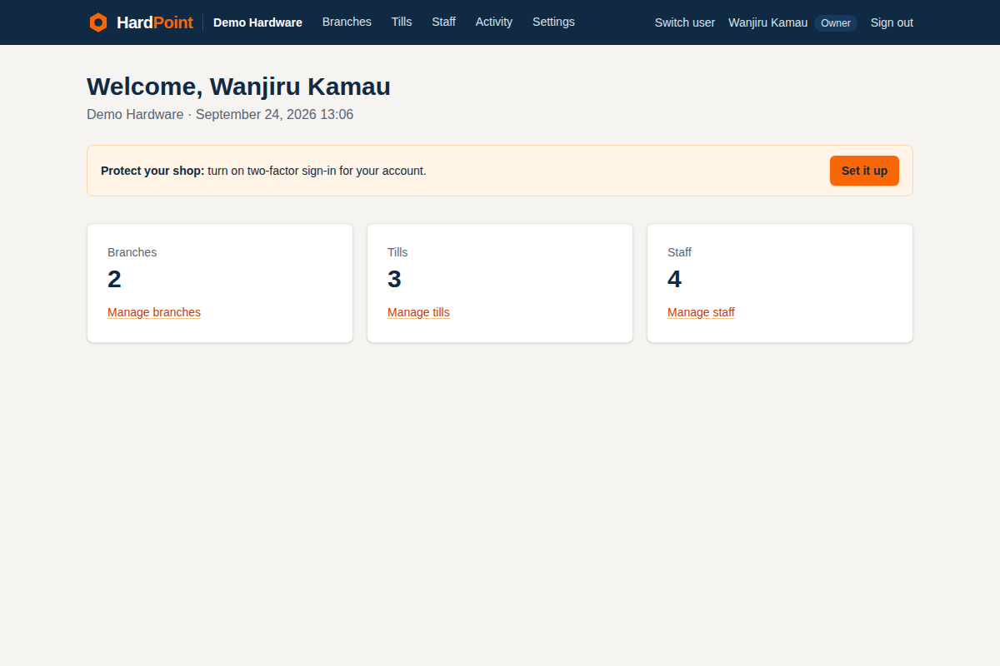

# HardPoint

Multi-tenant point of sale and stock control for hardware stores. Every shop gets its own
subdomain (`acme.hardpoint.app`), and no shop can see another shop's data.

Built the vanilla Rails way: Rails 8.1, PostgreSQL 18, Hotwire, Tailwind CSS 4, Solid Queue/Cache/Cable,
Minitest with fixtures, deployed with Kamal. See [docs/PLAN.md](docs/PLAN.md) for the full plan and
[docs/BRAND.md](docs/BRAND.md) for the brand colours.



## What's in it so far (Phase 1)

- **Shops on subdomains:** signup on the bare domain; each shop at `<name>.hardpoint.app`
- **Branches and tills** (registers) per shop
- **Staff and roles:** owner, manager, cashier, stock clerk, accountant; email invitations
- **Two-factor sign-in** (authenticator app + one-time recovery codes); shops can require it for owners and managers
- **Till PIN quick-switch:** cashiers and stock clerks switch in at a signed-in till with a 4–6 digit PIN (locks after 5 wrong tries)
- **Activity log:** an append-only audit trail of who changed what
- **Platform admin** on `admin.hardpoint.app`: separate sign-in with mandatory two-factor, a list of all shops, and
  support impersonation that is time-boxed to an hour, shown in a banner and recorded in the shop's Activity

Screenshots of every screen are in [docs/screenshots](docs/screenshots).

## Versions

| | Version |
|---|---|
| Ruby | 4.0.7 (`.ruby-version`) |
| Rails | 8.1.3 |
| PostgreSQL | 18 (production and CI) |
| Tailwind CSS | 4 via `tailwindcss-rails` |

## How shop data is kept apart

1. **Subdomain → `Current.account`.** `AccountScoped` resolves the shop from the subdomain on every request.
2. **Queries go through the account.** Always `Current.account.branches.find(id)`, never `Branch.find(id)`.
3. **Postgres row-level security.** Every table with an `account_id` has a policy that only exposes rows of the
   account in the `app.current_account_id` setting, which `Current.account=` keeps in step. With no account set,
   no rows are visible. Jobs remember the account they were enqueued under.

New tenant tables must call `enable_row_level_security :table_name` in their migration and use
`add_foreign_key ..., deferrable: :immediate`. `test/models/account/isolation_test.rb` fails if either is missing.

Row-level security doesn't apply to superusers or `BYPASSRLS` roles, so the app, including in development and
tests, connects as a regular role. Code that legitimately spans shops wraps itself in
`Account.without_isolation { ... }`.

## Development setup

```sh
# Once: a regular (non-superuser) database role for the app
sudo -u postgres psql -c "CREATE ROLE hardpoint LOGIN CREATEDB NOSUPERUSER NOBYPASSRLS PASSWORD 'hardpoint'"

bin/setup          # installs gems, prepares the database, seeds a demo shop, starts the server
```

Then open <http://localhost:3000> to sign up a shop, or <http://demo.localhost:3000> and sign in as
`owner@demo.test` / `hardpoint-demo`. Browsers resolve `*.localhost` to your machine. The demo cashier's till
PIN is `1234`.

The platform admin is at <http://admin.localhost:3000> (`admin@hardpoint.test` / `hardpoint-demo`). For two-factor,
add the development-only key `HARDPOINTDEVADMINTOTPSECRETKEYAB` to an authenticator app, or print a code with
`bundle exec ruby -rrotp -e 'puts ROTP::TOTP.new("HARDPOINTDEVADMINTOTPSECRETKEYAB").now'`.

Make someone a platform administrator from the console only (there's deliberately no UI for it):
`bin/rails runner 'User.find_by!(email_address: "you@example.com").update!(admin: true)'`

Override the database connection with `DATABASE_HOST`, `DATABASE_USERNAME` and `DATABASE_PASSWORD`.

## Checks

```sh
bin/rails test     # includes the tenant isolation tests
bin/rubocop
bin/brakeman
bin/bundler-audit
```

`bin/ci` runs them all, as GitHub Actions does.

## Deployment

Kamal deploys to a single Contabo VPS (see `config/deploy.yml`):

- PostgreSQL 18 runs as a Kamal accessory. `config/postgres/create_app_role.sh` creates the non-superuser `hardpoint` role on first boot.
- kamal-proxy serves `hardpoint.app` and `*.hardpoint.app` with a Cloudflare Origin CA certificate (Cloudflare SSL mode: Full (strict)).
- Email goes through AWS SES's SMTP interface. Add `ses: { smtp_username:, smtp_password:, region: }` with `bin/rails credentials:edit`.
- Two-factor secrets are encrypted with Active Record Encryption. Run `bin/rails db:encryption:init` and add the
  printed `active_record_encryption` keys with `bin/rails credentials:edit`. Development and test use fixed,
  non-secret keys.
- Secrets come from the environment (see `.kamal/secrets`): `POSTGRES_PASSWORD`, `HARDPOINT_DATABASE_PASSWORD`, and the Cloudflare origin certificate and key files.

```sh
bin/kamal setup    # first time
bin/kamal deploy
```
