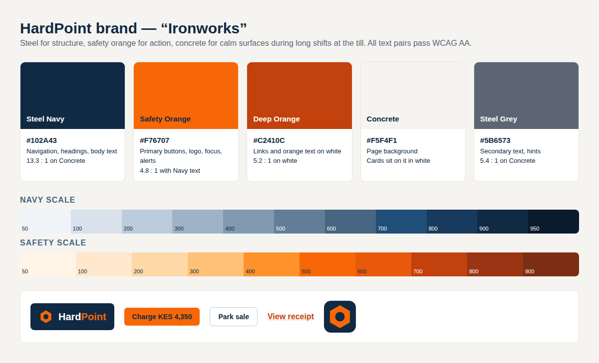

# HardPoint brand — "Ironworks"

**Idea:** steel for structure, safety orange for action, concrete for calm surfaces during long shifts at the till.
These are the colours of a hardware yard, so the product feels at home behind a counter, and orange draws the
cashier's eye to the one thing to press next.

| Token | Hex | Use | Contrast |
|---|---|---|---|
| `navy-900` Steel Navy | `#102A43` | Navigation bar, headings, body text | 13.3:1 on Concrete |
| `safety-500` Safety Orange | `#F76707` | Primary buttons (with navy text), logo, focus rings, attention banners | 4.8:1 with navy text |
| `safety-700` Deep Orange | `#C2410C` | Links and orange text on white | 5.2:1 on white |
| `concrete-100` Concrete | `#F5F4F1` | Page background; cards are white on top | — |
| `steel-600` Steel Grey | `#5B6573` | Secondary text and hints | 5.4:1 on Concrete |

Every text/background pair meets WCAG AA (4.5:1). Full scales (`navy-50…950`, `safety-50…900`, `concrete-50…300`,
`steel-500…700`) are defined as Tailwind theme tokens in `app/assets/tailwind/application.css`.

## Rules

- **One orange button per screen:** the main action (e.g. *Charge*, *Switch in*, *Save*). Everything else uses
  `btn-secondary`.
- **Orange buttons take navy text, not white.** White on Safety Orange is only 3.6:1 and fails AA.
- **Never set body text in orange.** Use `safety-700` for links only.
- Red (`red-700`) is reserved for destructive actions and errors; green for success notices.

## Logo

A hex nut (orange, with a navy or white centre) next to the wordmark **HardPoint**, with "Point"
in Safety Orange. Rendered by `app/views/shared/_logo.html.erb`. The app icon (`public/icon.svg`, `icon.png`) is the
nut on a navy rounded square.

## Components

Utilities in `application.css`: `btn-primary`, `btn-secondary`, `btn-danger`, `input`, `label`, `field`, `card`,
`link`, `hint`, `badge`, and the `.table` component.
